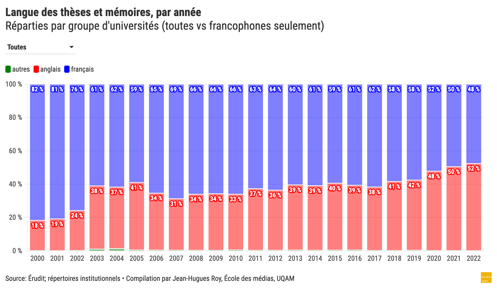

# La langue des thèses et mémoires au Québec (2000-2022)

Pour le [Forum La science en français, au Québec et dans le monde](https://frq.gouv.qc.ca/evenement/forum-la-science-en-francais-au-quebec-et-dans-le-monde-entre-richesse-et-rayonnement/) (26-27 avril 2023), j'ai présenté une mise à jour d'une étude sur la langue des thèses et mémoires au Québec entre 2000 et 2022.

C'est la troisième édition d'une étude que j'ai [réalisée pour la première fois en 2016](https://github.com/jhroy/theses) et que j'ai [mise à jour en 2021](https://github.com/jhroy/theses2021).

La méthodologie ressemble beaucoup à l'étude de 2021. Les données sont cependant beaucoup plus considérables. Elles couvrent plus de 110&nbsp;000 thèses et mémoires publiés au Québec entre 2000 et 2022. Je les partage ici dans le fichier suivant:

* [**thesesMemoiresQC2000-2022.csv**](https://doi.org/10.5683/SP3/E7MS9S)

===

Parmi les questions auxquelles ce fichier permet de répondre&nbsp;: quelle est la répartition de la langue des thèses et mémoires par année au Québec?

